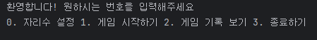
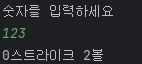

# 프로젝트 소개
숫자야구 게임을 구현

 

# 주요 기능
BaseballGame : 숫자야구의 전반적인 로직 부분을 담당하는 클래스
- setresultNum() : 자리수에 맞게 랜덤한 정답값을 생성
- play() : 숫자야구의 게임을 실행하는 부분
- countStrike() : 스트라이크의 개수를 확인
- countBall : 볼의 개수를 확인

 

Validation : 값에대한 오류를 처리하는 클래스
- validateInput() : 사용자로부터 입력받은 값에 대해 오류를 판별

 

BadInputException 클래스 : 사용자지정 예외 클래스

 

Main : 난이도조절, 게임 실행, 기록 확인 등을 할 수 있는 클래스

 

# 실행 방법
<게임 메뉴>

- 0을 입력하면 게임의 난이도를 설정한다. 이후 3, 4, 5 중에 원하는 난이도를 입력해서 설정한다.

- 1을 입력하면 게임을 시작한다. 설정한 난이도에 따라 랜덤으로 3, 4, 5 자리 숫자가 정답으로 생성된다.(중복 제외, 0 제외)
예측되는 숫자를 입력해서 정답을 맞추면 된다.
  - 숫자를 입력하면 정답과 비교해서 힌트를 출력한다.
  
    

  - 정답을 맞히면 게임 메뉴로 돌아온다

- 2를 입력하면 게임 기록을 불러온다.

- 3을 입력하면 게임을 종료한다.

 

- 게임을 종료하기(3)를 입력하기 전까지는 게임 메뉴 부분은 계속 반복된다.